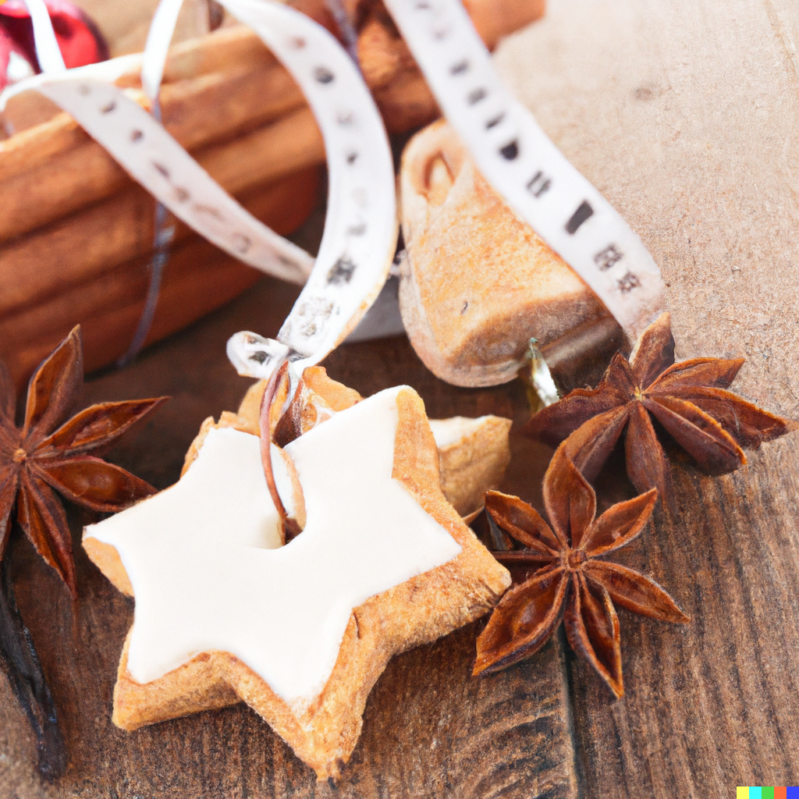

- [Cookies](#cookies)
- [Icing](#icing)

Indulge in the festive flavors of gingerbread with these delicious cookies. Made with warm spices, molasses, and
vanilla, they are the perfect balance of sweet and spicy. The dough is easy to work with, and the icing adds a touch of
sweetness and color. Perfect for a fun activity with the kids or to share with friends and family during the holiday
season.

## Cookies

### Ingredients

- 450 grams all-purpose flour
- 5 grams baking soda
- 5 grams ground ginger
- 5 grams cinnamon
- 1 gram ground cloves
- 1 gram ground nutmeg
- 125 grams unsalted butter, softened
- 125 grams dark brown sugar
- 1 large egg
- 125 milliliters unsulphured molasses
- 5 milliliters vanilla extract

### Instructions

1) In a medium bowl, whisk together the flour, baking soda, ground ginger, cinnamon, ground cloves, and ground nutmeg.
2) In a separate large bowl, cream together the butter and dark brown sugar until smooth. Add the egg, molasses, and
   vanilla extract, stirring until well combined.
3) Gradually add the dry ingredients to the wet ingredients, stirring until a smooth dough forms. Cover the dough with
   plastic wrap and refrigerate for at least 1 hour, or until firm.
4) Preheat the oven to 180°C. Line a baking sheet with parchment paper.
5) On a lightly floured surface, roll out the dough to a thickness of about 0.6cm. Use cookie cutters to cut out the
   dough into desired shapes. Transfer the cut-out dough to the prepared baking sheet.
6) Bake the cookies for 8-10 minutes, or until they are lightly browned around the edges. Transfer the cookies to a wire
   rack to cool.

## Icing

### Ingredients

- 200 grams confectioners' sugar
- 3-4 tablespoons milk
- 5 milliliters vanilla extract

### Instructions

1) In a medium bowl, whisk together the confectioners' sugar, 3 tablespoons of milk, and the vanilla extract until
   smooth.
2) If the icing is too thick, add more milk, 1 tablespoon at a time, until the desired consistency is achieved.
3) Use a spoon or a piping bag to decorate the cookies with the icing. You can also add food coloring to the icing to
   create different colors, if desired.

<figure style="pointer-events: none;">

<figcaption>You can go nuts with the presentation afterwards, but don't forget to eat them!</figcaption>
</figure>
