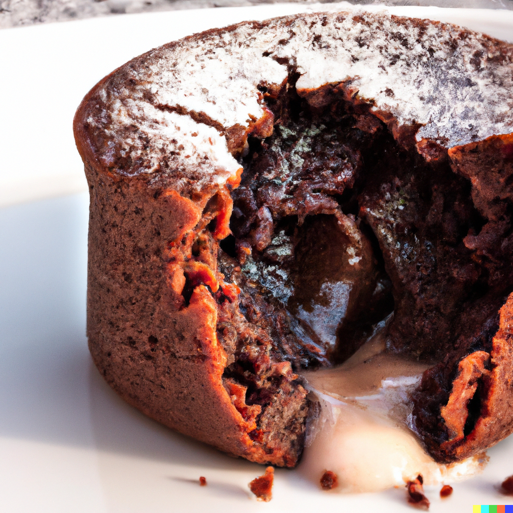

Indulge in the decadent, chocolatey goodness of these homemade lava cakes. With gooey chocolate centers
and a crispy exterior, these cakes are sure to
be a hit with any chocolate lover. Satisfy your sweet tooth with this easy and delicious recipe.

### Ingredients

- 100g chocolate
- 2 eggs
- 70g butter
- 30g flour
- 50g powdered sugar

### Instructions

1) Preheat the oven to 200C (400F). Grease 4 ramekins with butter and dust with flour.
2) In a small saucepan, melt the butter and chocolate chips together over low heat. Stir until smooth.
2) In a separate bowl, mix the powdered sugar, eggs, and flour together until well combined.
2) Stir the chocolate mixture into the sugar mixture until well combined.
2) Pour the batter into the prepared ramekins, filling them about 3/4 of the way full.
2) Place the ramekins on a baking sheet and bake for 10-15 minutes (10 minutes if you make 4 cakes,
   15 if you make 2), or until the edges are set but the center is still soft.
2) Let the cakes cool for a few minutes before carefully removing them from the ramekins.
2) Dust with powdered sugar and serve warm.

### Tips

- If no ramekins are available, you can use a muffin tin.
- If no muffin tin is available, you can fashion one with aluminium foil around a glass. Instructions are below.
- Add a scoop of ice cream: A scoop of vanilla or chocolate ice cream on top of the lava cake will add an extra layer of creaminess and sweetness.
- Experiment with different flavors: Lava cakes can be made with different types of chocolate, such as dark,
  milk, or white, or flavored with different extracts, such as vanilla, raspberry or orange. You can also add
  nuts, fruits, or spices to the batter for a unique twist.
- Don't over mix the batter, it will result in a less gooey center.

### Instructions on making aluminium foil cups

1) Cut a piece of aluminum foil that is about 30cm long.
2) Fold it in half to create a 15cm long strip.
3) Take one end of the strip and shape it into a cup by pressing it into the shape of a small bowl or cup. The foil should be about 2-3cm tall to hold the batter.
4) Repeat this process to make as many cups as you need, depending on how many lava cakes you are making.
5) Place the foil cups on a baking sheet and lightly grease them with butter or cooking spray.
6) Pour the batter into the cups, filling them about 3/4 of the way full.
7) Carefully place the baking sheet with the foil cups in the oven and bake as directed in the recipe.
   Keep an eye on the cakes while they're baking and check for doneness.

<figure style="pointer-events: none;">

<figcaption>Lava cakes are sure to be a hit with anybody!</figcaption>
</figure>
