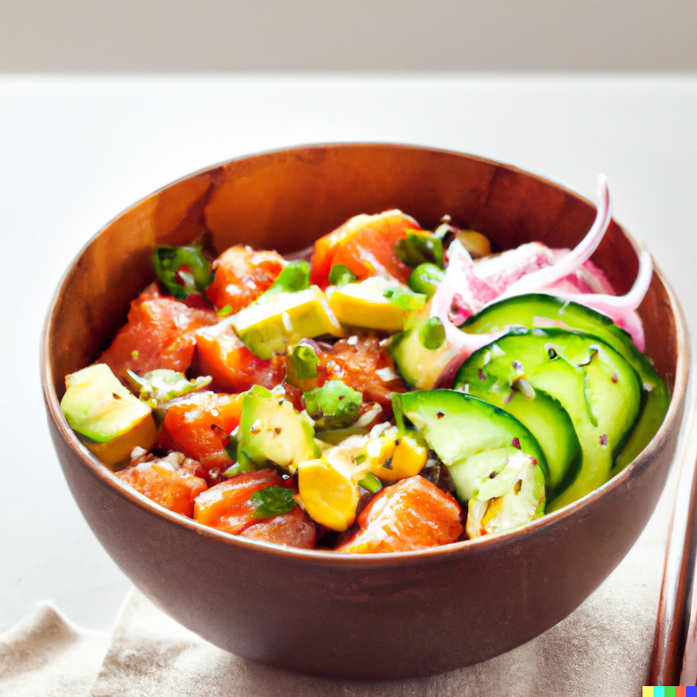

Enjoy a taste of the Pacific with this easy and flavorful salmon poke bowl recipe. Perfectly cooked salmon is
mixed with fresh cucumber, creamy avocado, and sweet onion, then tossed in a delicious dressing made from
sesame oil, soy sauce, rice vinegar, honey, and grated ginger. Serve over steaming hot rice for a satisfying
and healthy meal for two. Whether you're in the mood for a quick lunch or a delicious dinner, this poke bowl
recipe is sure to please.

### Ingredients

- 200g cooked salmon, skin removed and cubed
- 60g diced onion (half an onion)
- 60g diced cucumber
- 60g diced avocado (or up to one avocado)
- 7.5mL sesame oil (1 tbsp)
- 15mL soy sauce (2 tbsp)
- 7.5mL rice vinegar (1 tbsp)
- 2.5mL honey (1 tsp)
- 2.5g grated ginger (1 tsp)
- 450g cooked rice
- Sesame seeds, for garnish

### Instructions

1) In a large bowl, mix together the salmon, onion, cucumber, and avocado.
2) In a separate bowl, whisk together the sesame oil, soy sauce, rice vinegar, honey, and grated ginger to
   make the dressing.
3) Pour the dressing over the salmon mixture and toss to combine.
4) Divide the cooked rice into bowls and top with the salmon mixture.
5) Sprinkle with sesame seeds and serve immediately.

### Tips

- Use high-quality salmon for the best flavor and texture. Look for fresh or frozen salmon that is sustainably sourced.
- If using frozen salmon, be sure to thaw it completely before using. Pat it dry with paper towels to remove any excess moisture.
- The dressing is key to the flavor of the poke bowl. Mix it well to ensure that all ingredients are well combined.
- To enhance the flavor and texture of the poke bowl, add some crispy and crunchy toppings like sesame seeds, seaweed, or toasted nuts.
- Serve the poke bowl immediately, as the ingredients tend to wilt and release excess moisture over time. To avoid this, prepare the ingredients just before serving.

<figure style="pointer-events: none;">

<figcaption>Who said healthy food had to be boring?</figcaption>
</figure>
