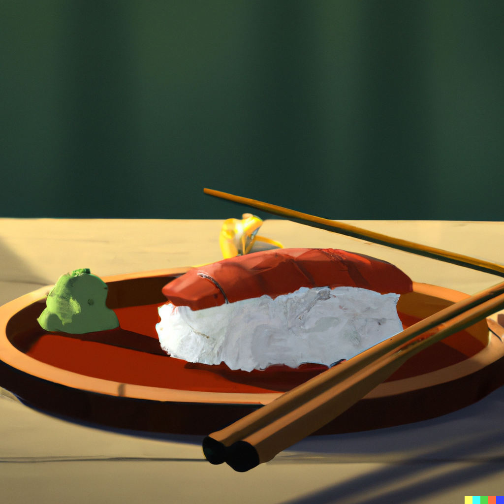

Making delicious sushi starts with having the perfect sushi rice, and this recipe for sushi rice for two is a
great place to start. With its soft, sticky texture and sweet-tangy flavor, the rice serves as the perfect
foundation for any sushi roll, making it essential for creating tasty and authentic sushi at home.

### Ingredients

- 1 cup (200g) sushi rice
- 1 1/4 cups (300ml) water
- 2 tablespoons (30ml) rice vinegar
- 2 tablespoons (25g) granulated sugar
- 1/2 teaspoon (3g) salt

### Instructions

1. Rinse the sushi rice in a fine-mesh strainer until the water runs clear.
2. Add the rice and water to a medium saucepan and bring to a boil over high heat.
3. Reduce the heat to low and cover the pot with a tight-fitting lid. Cook the rice for 15-20 minutes, or until the water is fully absorbed.
4. In a small saucepan, heat the rice vinegar, sugar, and salt over medium heat until the sugar and salt are dissolved.
5. Once the rice is cooked, remove it from the heat and let it sit for 10 minutes, covered.
6. Transfer the rice to a large mixing bowl and add the vinegar mixture, stirring gently to combine.
7. Allow the rice to cool to room temperature before using it to make sushi.

### Tips

- Rinse the rice thoroughly: Rinse the rice in a fine-mesh strainer until the water runs clear to remove excess starch and impurities.
  This will help to prevent the rice from becoming too sticky.
- Use the right amount of water: Use the correct ratio of water to rice to ensure that the rice cooks evenly and has the right
  texture. In this recipe, the ratio is 1 1/4 cups of water to 1 cup of sushi rice.
- Let the rice sit after cooking: Once the rice is cooked, remove it from the heat and let it sit covered
  for 10 minutes. This allows the rice to absorb any remaining moisture and become fluffy.
- Don't over-stir the rice: When mixing the rice with the vinegar mixture, be gentle and don't over-stir the
  rice. Over-stirring can cause the rice to become too sticky and mushy.
- Use sushi-grade rice: Use high-quality, sushi-grade rice to ensure the best flavor and texture.
  Lower-quality rice may not have the same stickiness or flavor, and could affect the quality of your
  sushi rolls.

<figure style="pointer-events: none;">

<figcaption>Great sushi rice is so key!</figcaption>
</figure>
