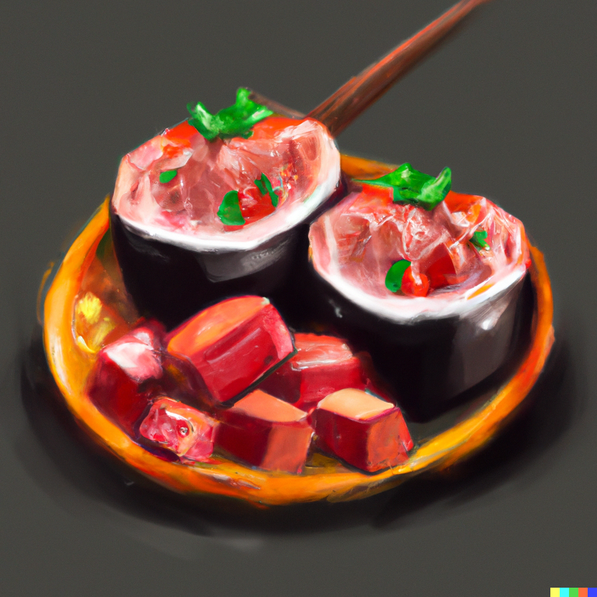

In this recipe, we'll show you how to create a delicious spicy tuna dish with a unique twist - the addition
of sesame oil! Discover how this simple ingredient can take your sushi game to the next level and make your
taste buds dance.

### Ingredients

- 250g fresh sushi-grade tuna
- 2 tbsp mayonnaise
- 1 tbsp sriracha sauce
- 1 tsp sesame oil
- 1 tsp soy sauce
- 1/2 tsp sugar
- 1/4 tsp garlic powder
- 1/4 tsp onion powder

### Instructions

1. Begin by preparing the tuna. Cut it into small, bite-sized cubes and set it aside in a bowl.
2. In a separate bowl, mix together the mayonnaise, sriracha sauce, sesame oil, soy sauce, sugar, garlic powder, and onion powder. Stir until the ingredients are well combined.
3. Pour the spicy mayo mixture over the tuna and mix gently until the tuna is evenly coated.
4. Allow the spicy tuna to marinate in the fridge for at least 10 minutes before serving. This will allow the flavors to meld together and the tuna to absorb the sauce.
5. Serve the spicy tuna as a topping for sushi rolls or as a standalone dish.

### Tips

- Use the freshest tuna you can find - the better the quality of the tuna, the better the final dish will taste.
- Adjust the level of spiciness to your taste by adding more or less sriracha sauce.
- When marinating the spicy tuna, make sure to cover the bowl with plastic wrap or a lid to prevent any air from getting in and drying out the tuna.
- If you're serving the spicy tuna as a standalone dish, consider adding some sliced avocado or cucumber to balance out the heat.
- Make sure to use sushi-grade tuna - this is important for both the taste and safety of the dish.

<figure style="pointer-events: none;">

<figcaption>One of the finest fillings for makis, tastes as if it should be complicated, but really isn't!</figcaption>
</figure>
