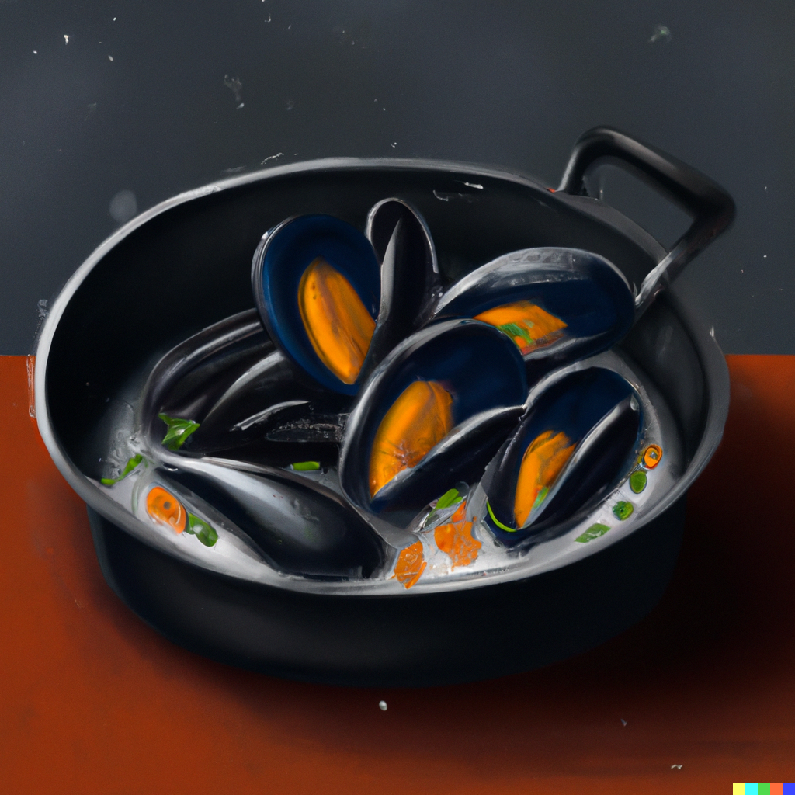

Mussels are a delicious and healthy seafood option that can be enjoyed in a variety of ways. This easy and
elegant recipe for mussels in white wine sauce is perfect for a special occasion, or a quick weeknight dinner.
With just a few simple ingredients, you can create a delicious and flavorful seafood dish that is sure to
impress your guests.

### Ingredients

- 2 kg fresh mussels, cleaned and debearded
- 1 shallot, finely chopped
- 3 cloves of garlic, minced
- 120 ml dry white wine
- 60 ml heavy cream
- 1 tablespoon unsalted butter
- 1 tablespoon olive oil
- 2 tablespoons chopped fresh parsley
- Salt and pepper, to taste

### Instructions

1. Rinse the mussels under cold running water, scrubbing any dirt or debris from the shells.
   Discard any mussels that are open and don't close when tapped on a hard surface, as they may be dead
   and unsafe to eat.
2. In a large pot or Dutch oven, heat the olive oil and butter over medium heat. Add the chopped shallot
   and minced garlic, and cook for 1-2 minutes until softened and fragrant.
3. Add the white wine to the pot and bring to a simmer. Add the mussels to the pot and stir well to coat them
   in the liquid. Cover the pot and let the mussels steam for 5-7 minutes, or until they have opened up.
4. Use a slotted spoon to remove the cooked mussels from the pot and transfer them to a serving bowl,
   discarding any mussels that didn't open.
5. Increase the heat to high and let the cooking liquid reduce by half. Stir in the heavy cream and chopped
   parsley, and season with salt and pepper to taste.
6. Pour the white wine sauce over the cooked mussels in the serving bowl, and serve immediately with
   crusty bread on the side for dipping in the sauce.

### Tips

1. Make sure to clean and debeard the mussels thoroughly before cooking.
2. Use a good quality dry white wine for the sauce.
3. Don't overcook the mussels, as they can become tough and rubbery.
4. Serve the mussels with plenty of crusty bread to soak up the delicious sauce.
5. Garnish with fresh herbs, such as parsley or chives, for a pop of color and flavor.

<figure style="pointer-events: none;">

<figcaption>A true Belgian classic, yet so easy to make!</figcaption>
</figure>
