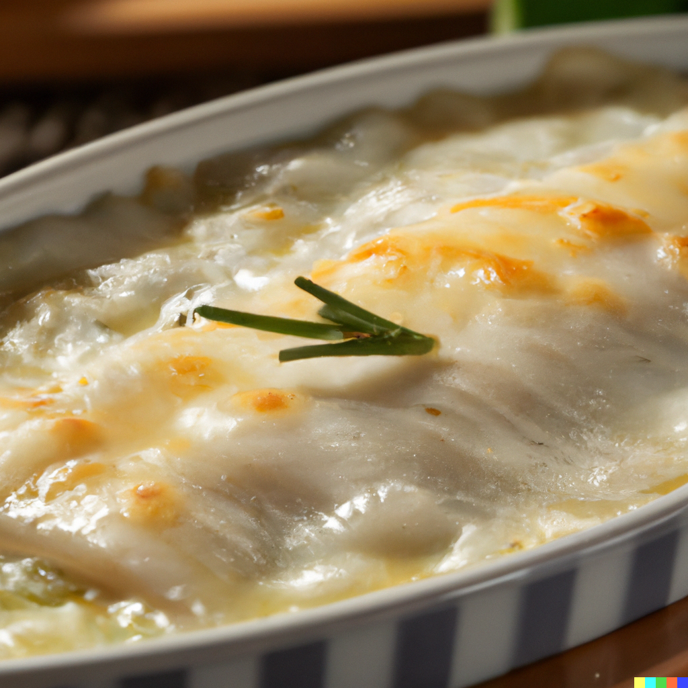

Looking for a delicious and easy recipe for a cozy dinner at home? Look no further than this creamy
lumpfish gratin! With tender potatoes, flavorful fish, and a cheesy cream sauce, this dish is sure to
be a hit with your family or guests. Plus, it's easy to make and uses just a few simple ingredients.

### Ingredients

- 500g fish (e.g. lumpfish) fillet, skin removed
- 600g potatoes, peeled and thinly sliced
- 1 large onion, finely chopped
- 2 garlic cloves, minced
- 300ml heavy cream
- 100g grated Parmesan cheese
- 3 tbsp olive oil
- Salt and pepper, to taste
- Fresh parsley, chopped (for garnish)

### Instructions

1. Preheat the oven to 190°C.
2. Grease a medium-sized baking dish with olive oil.
3. Layer the sliced potatoes in the bottom of the dish.
4. Heat the remaining olive oil in a pan over medium heat.
5. Add the chopped onion and minced garlic to the pan and cook until softened, about 3-4 minutes.
6. Cut the lumpfish fillet into bite-sized pieces and add it to the pan. Cook for another 2-3 minutes, or until the fish is lightly browned on the outside.
7. Season the fish and onion mixture with salt and pepper to taste.
8. Spoon the fish and onion mixture over the sliced potatoes in the baking dish.
9. Pour the heavy cream over the top of the fish and potatoes.
10. Sprinkle the grated Parmesan cheese evenly over the top of the cream.
11. Bake in the preheated oven for 25-30 minutes, or until the potatoes are tender and the top
    is golden brown.
12. Garnish with chopped parsley and serve hot.

### Tips

1. Use fresh lumpfish fillet: The quality of the fish you use will impact the taste and texture of the dish,
   so try to use fresh lumpfish fillet if possible. Look for fillets that are firm, glossy, and have a mild
   scent of the sea.
2. Slice the potatoes thinly: To ensure that the potatoes cook evenly and are tender in the finished dish,
   be sure to slice them thinly. You can use a mandolin slicer or a sharp knife to achieve even slices.
3. Don't overcook the fish: Lumpfish fillet cooks quickly, so be sure to only cook it until it is lightly
   browned on the outside. Overcooked fish can become tough and dry, which can affect the overall taste and
   texture of the dish.
4. Add herbs or spices for extra flavor: While this recipe uses just a few simple ingredients, you can add
   herbs or spices to customize the flavor to your liking. Try adding some thyme, dill, or paprika to the fish
   and onion mixture before spooning it over the potatoes.
5. Let the gratin rest before serving: After you've removed the gratin from the oven, let it rest for a few
   minutes before serving. This will allow the cream to set slightly and make it easier to serve. Plus, the
   flavors will continue to meld and develop as the dish cools.

<figure style="pointer-events: none;">

<figcaption>Easy to make, but deliciously creamy - the fish gratin!</figcaption>
</figure>
